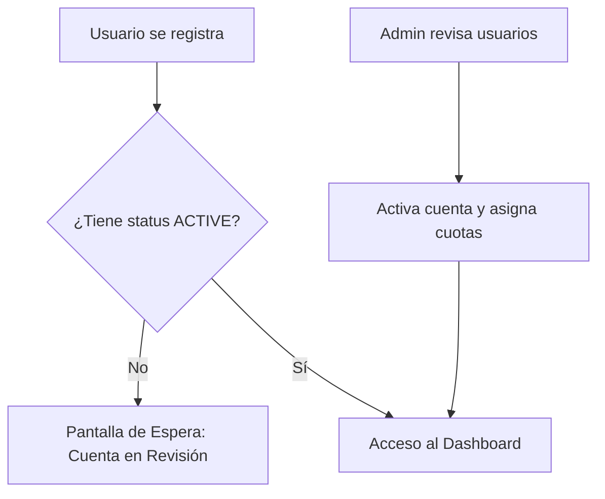
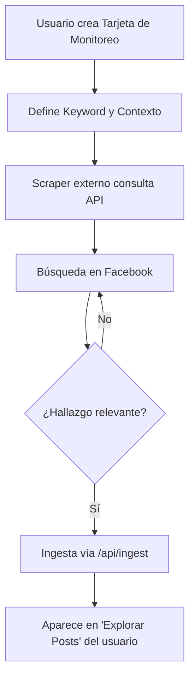
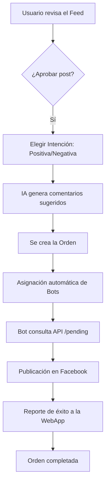
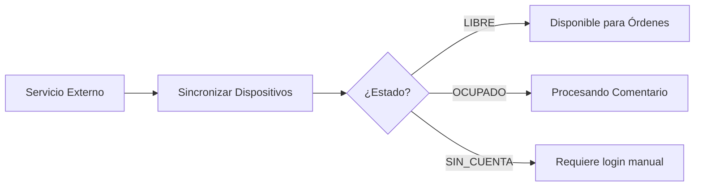

# Flujos de Usuario y Procesos: TeloComento

Este documento visualiza los procesos clave dentro de la plataforma utilizando diagramas de flujo.

## 1. Registro y Activación de Cuenta

## 2. Ciclo de Monitoreo y Scraping

## 3. De Hallazgo a Comentario Publicado

## 4. Gestión de Bots (Admin)

